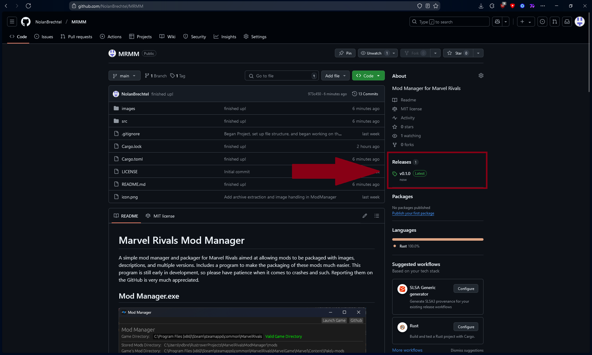
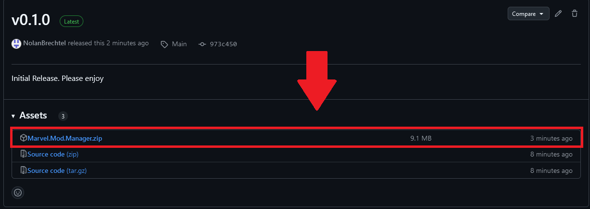
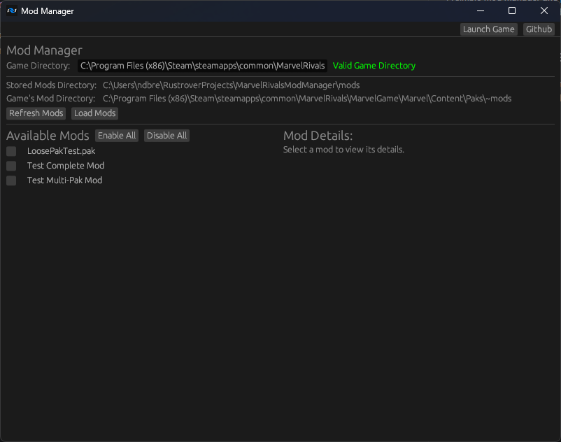
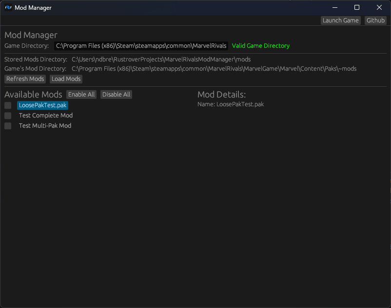
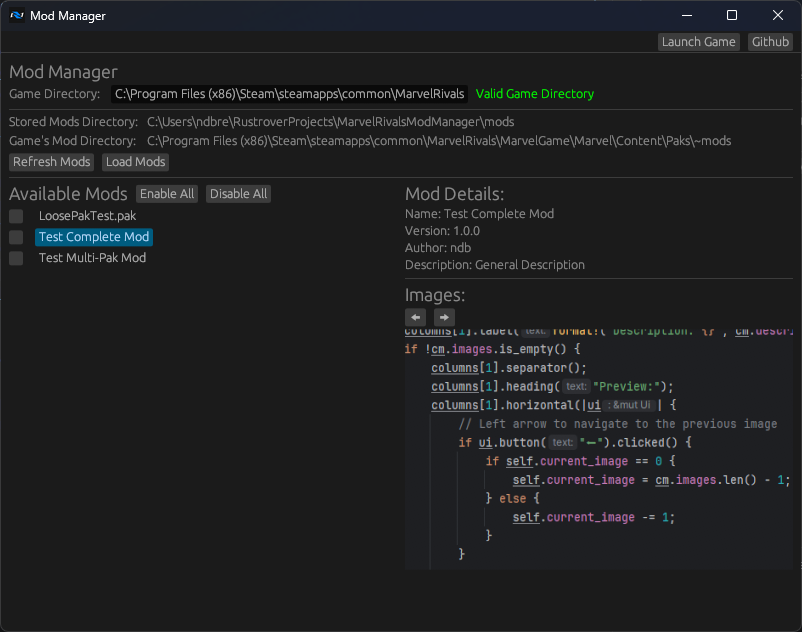
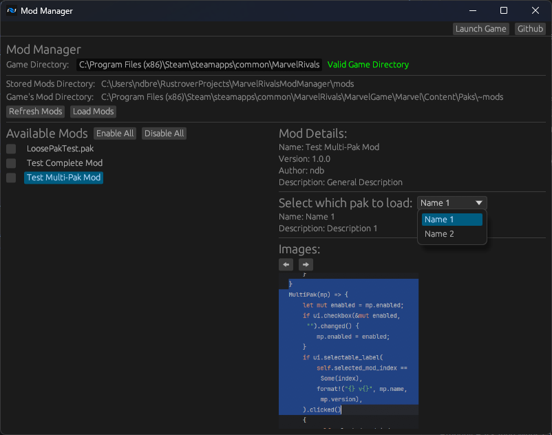

To download, get from the releases tab on the right!

and download the .zip!

Then extract to somewhere safe and enjoy!

# Marvel Rivals Mod Manager

A simple mod manager and packager for Marvel Rivals aimed at allowing mods to be packaged with images, descriptions,
and multiple versions. Includes a program to make the packaging of these mods much easier. This program is still early
in development, so please have patience when it comes to crashes and such. Reporting them on the GitHub is very much 
appreciated.

## Mod Manager.exe

To load mods into the mod manager, you can place the folders into the "mods" folder or just drop the files into the window. 
if you don't see the mods appear, press the reload mods button. To uninstall all mods, uncheck everything and load mods.

The mod manager can handle folders and .zip and .7z archives. The program should attempt to find the game directory automagically,
but if it fails to you can edit that field yourself. The Launch Game button attempts to launch the game through steam, but may cause the 
program to crash if it cannot locate the steam installation (I am working on that). Launching the game manually through steam works
perfectly fine though.

To load mods into the game, check which mods you want to load and select the Pak to use for the multiple .pak mods. 

The mod manager supports 3 formats of mods:
1. Loose .pak files
2. Properly Packaged Mods
3. Multiple .pak Mods

Loose .pak files won't have any information attached to them, so no images, authors, etc.

Properly Packaged Mods can have an author, version, name, description, and any number of images associated.

Multiple .pak Mods can have an author, version, name, and description, along with any number of .pak files, each with 
their own names, descriptions, and images.

## Mod Packager.exe

This is mainly for mod makers or people that want to convert mods to a packaged one. It is a little unstable, but I think I 
ironed out most of the bugs. It is capable of building normal mods and multipak mods. To add the .pak(s) to the mod, drag and 
drop their files on the window. Same for the images. For multipak mods you will also be prompted to select which images to associate with 
each .pak. If you want to reset, toggling between each mod type will reset the progress. Once done, press "Build" and a folder will be made with 
the packaged mod.

## Planned features:
1. Profiles for different mods combinations
2. A preview for the mod builder
3. A better ui